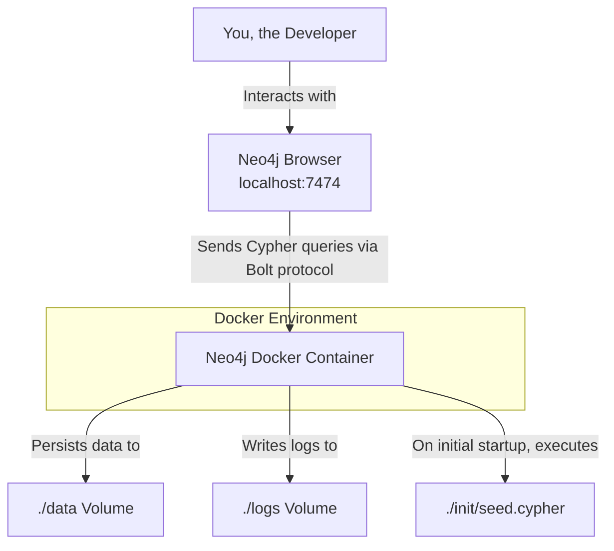

# Movie Knowledge Graph with Neo4j and Docker

This project demonstrates the creation and management of a containerized movie knowledge graph using Neo4j and Docker. It includes data modeling, database seeding, and various Cypher queries for data manipulation and analysis.

## Features

- **Dockerized Neo4j**: Runs Neo4j in a Docker container for a reproducible environment.
- **Automated Seeding**: Initializes the database with constraints, nodes (Movie, Person, Genre), and relationships on the first startup.
- **Cypher Queries**: A collection of scripts for interacting with the graph database.

## Architecture



## Prerequisites

- [Docker](https://www.docker.com/) and [Docker Compose](https://docs.docker.com/compose/) installed on your machine.

## Setup Instructions

1. **Environment Variables**:
   Copy `.env.example` to `.env` and set your secure password for `NEO4J_AUTH`.
   ```bash
   cp .env.example .env
   # Edit .env and change your-secure-password
   ```

2. **Start the Database**:
   Run the following command to start the Neo4j container in the background:
   ```bash
   docker-compose up -d
   ```

3. **Access Neo4j Browser**:
   Open your web browser and navigate to `http://localhost:7474`. Log in with the username `neo4j` and the password you set in the `.env` file.

## Data Model

- **Nodes**:
  - `Movie` (properties: `title` [unique], `released`, `tagline`, `rating`)
  - `Person` (properties: `name` [unique], `born`)
  - `Genre` (properties: `name` [unique])
- **Relationships**:
  - `ACTED_IN` (properties: `roles` [list of strings])
  - `DIRECTED`
  - `PRODUCED`
  - `HAS_GENRE`

## Queries

The `queries/` directory contains various Cypher scripts to interact with the database:

- `create_movie.cypher`: Creates "V for Vendetta" and connects it to "Hugo Weaving".
- `find_actor_movies.cypher`: Finds all movies "Keanu Reeves" has acted in.
- `find_co_actors.cypher`: Finds co-actors of "Hugo Weaving" in "The Matrix".
- `update_movie_rating.cypher`: Updates the rating of "The Matrix" to 8.7.
- `delete_movie.cypher`: Deletes the movie "To Be Deleted".
- `analytics_degree.cypher`: Finds the top 5 most connected people.

To run these queries, you can copy their contents and execute them in the Neo4j Browser.

## Resetting the Database

If you need to re-run the initial seed script, you must remove the existing container and its data volume:

```bash
docker-compose down -v
docker-compose up -d
```
