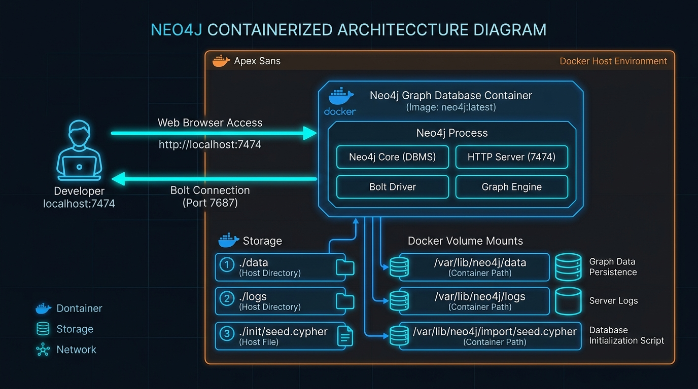
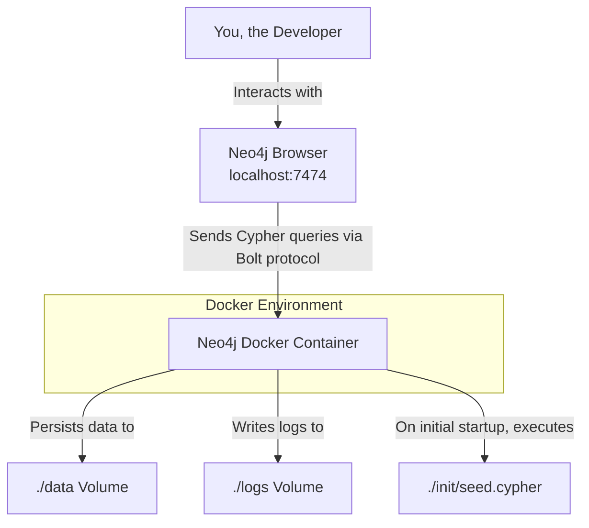
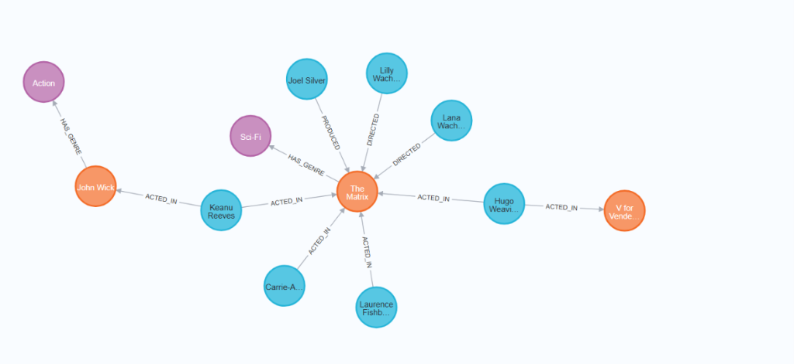
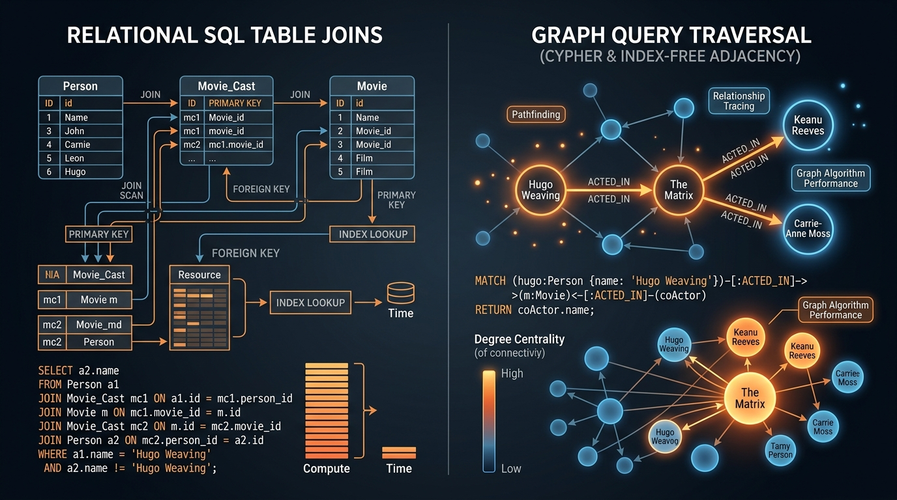

# 🎬 Movie Knowledge Graph with Neo4j & Docker

[](https://neo4j.com/)
[](https://www.docker.com/)
[](https://neo4j.com/developer/cypher/)
[](LICENSE)

An enterprise-grade, containerized **Movie Knowledge Graph** built using **Neo4j DBMS** and **Docker Compose**. This project models highly connected entertainment data (Movies, Cast, Directors, Producers, Genres) into a high-performance property graph database, demonstrating declarative Cypher query traversal, index-free adjacency performance, automated database seeding, and container lifecycle orchestration.

---

## 📐 System Architecture & Flow

The application runs as an isolated microservice environment managed by Docker Compose. The persistent storage volumes, logs, and database startup seed scripts are seamlessly bound from the host environment to the containerized Neo4j database instance.

### System Architecture Diagram




---

## 🧬 Graph Data Model Schema

Unlike relational databases that rely on expensive multi-table `JOIN` operations, this graph database leverages **Index-Free Adjacency**—where nodes maintain direct memory pointers to adjacent nodes via typed, directed relationships.



### Node Labels & Properties
| Node Label | Property Key | Data Type | Constraint | Description |
| :--- | :--- | :--- | :--- | :--- |
| `Movie` | `title` | `String` | `UNIQUE` | Unique title of the movie (e.g., *The Matrix*) |
| `Movie` | `released` | `Integer` | - | Release year of the movie |
| `Movie` | `tagline` | `String` | - | Promotional tagline |
| `Movie` | `rating` | `Float` | - | User / Critic rating out of 10.0 |
| `Person` | `name` | `String` | `UNIQUE` | Unique full name of the actor/crew member |
| `Person` | `born` | `Integer` | - | Birth year of the person |
| `Genre` | `name` | `String` | `UNIQUE` | Unique category name (e.g., *Sci-Fi*, *Action*) |

### Relationship Types & Directionality
```
(p:Person)-[:ACTED_IN {roles: ['Neo']}]->(m:Movie)
(p:Person)-[:DIRECTED]->(m:Movie)
(p:Person)-[:PRODUCED]->(m:Movie)
(m:Movie)-[:HAS_GENRE]->(g:Genre)
```

---

## ⚡ Relational SQL vs. Graph Traversal



### Why Graph Databases for Connected Data?
1. **Constant-Time Path Traversal**: Traversal speed depends only on the sub-graph visited, not the total database size ($\mathcal{O}(1)$ pointer hops vs $\mathcal{O}(N \log N)$ table scans).
2. **Flexible Schema**: Add new node labels, attributes, or relationship types without running heavy database migrations (`ALTER TABLE`).
3. **Natural Pattern Matching**: Cypher patterns match human intuition: `(Actor)-[:ACTED_IN]->(Movie)<-[:ACTED_IN]-(CoActor)`.

---

## 🚀 Quickstart & Setup Guide

### 1. Prerequisites
- [Docker Engine](https://docs.docker.com/get-docker/) (v20.10+)
- [Docker Compose](https://docs.docker.com/compose/install/) (v2.0+)

### 2. Environment Configuration
Copy the provided `.env.example` template to `.env` and specify your authentication credentials:
```bash
cp .env.example .env
```
*`.env` contents:*
```env
NEO4J_AUTH=neo4j/your-secure-password
```

### 3. Launch Containerized Instance
Start the Neo4j container in detached daemon mode:
```bash
docker-compose up -d
```
Verify container status and health check:
```bash
docker-compose ps
```

### 4. Access Interactive Neo4j Browser Interface
Open your web browser and navigate to:
- **URL**: `http://localhost:7474`
- **Bolt Port**: `bolt://localhost:7687`
- **Username**: `neo4j`
- **Password**: `your-secure-password` (or the custom password set in `.env`)

---

## 📜 Cypher Queries Reference

The [`queries/`](queries) folder provides pre-built Cypher scripts for data manipulation, graph traversal, and degree centrality analysis:

| Script File | Query Purpose | Key Cypher Operations |
| :--- | :--- | :--- |
| [`create_movie.cypher`](queries/create_movie.cypher) | Creates *V for Vendetta* and links actor Hugo Weaving | `MATCH`, `CREATE` |
| [`find_actor_movies.cypher`](queries/find_actor_movies.cypher) | Retrieves all filmography titles for Keanu Reeves | `MATCH (p)-[:ACTED_IN]->(m)`, `RETURN` |
| [`find_co_actors.cypher`](queries/find_co_actors.cypher) | Finds co-actors of Hugo Weaving in *The Matrix* (excl. self) | `MATCH ...<-[:ACTED_IN]-(p2)`, `WHERE p1 <> p2` |
| [`update_movie_rating.cypher`](queries/update_movie_rating.cypher) | Updates rating property of *The Matrix* to 8.7 | `MATCH`, `SET m.rating = 8.7` |
| [`delete_movie.cypher`](queries/delete_movie.cypher) | Safely removes target movie and attached edges | `MATCH`, `DETACH DELETE` |
| [`analytics_degree.cypher`](queries/analytics_degree.cypher) | Ranks top 5 most connected people by degree centrality | `MATCH (p)-[r]-()`, `count(r)`, `ORDER BY degree DESC` |

---

## 🧹 Database Reset & Re-seeding

To perform a clean database reset and re-trigger automated initialization scripts:
```bash
# Stop containers and remove volume mounts
docker-compose down -v

# Re-launch and auto-seed database
docker-compose up -d
```

---

## 🛠️ Project Structure

```
.
├── .env                    # Runtime environment variables (git-ignored)
├── .env.example            # Template for environment configuration
├── docker-compose.yml      # Multi-container orchestration definition
├── assets/                 # Architecture & graph schema visual diagrams
│   ├── architecture_diagram.jpg
│   ├── graph_schema_diagram.jpg
│   └── cypher_analytics_diagram.jpg
├── init/                   # Automated initialization directory
│   └── seed.cypher         # Idempotent MERGE database seed script
└── queries/                # Cypher analytical & CRUD query suite
    ├── analytics_degree.cypher
    ├── create_movie.cypher
    ├── delete_movie.cypher
    ├── find_actor_movies.cypher
    ├── find_co_actors.cypher
    └── update_movie_rating.cypher
```
